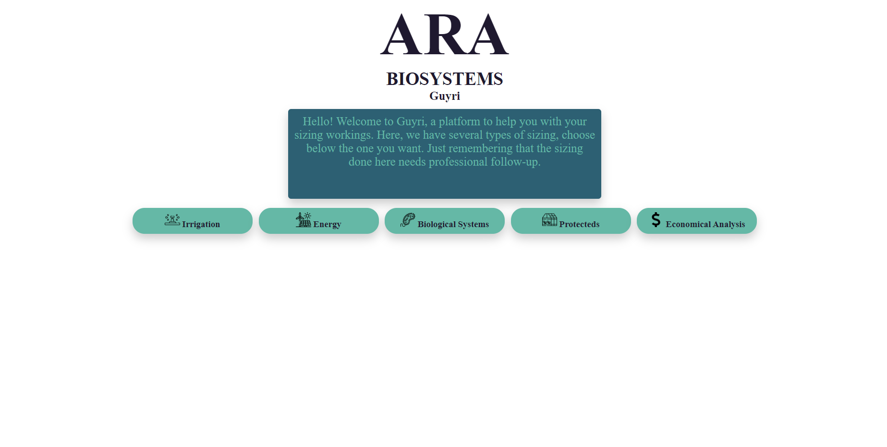
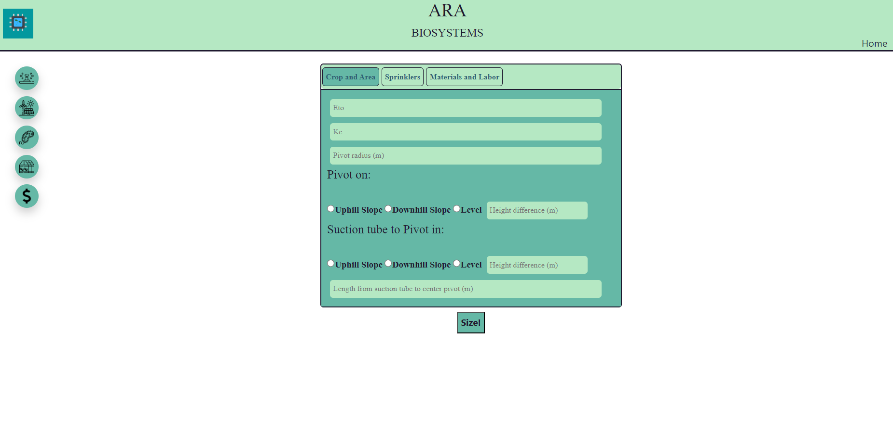
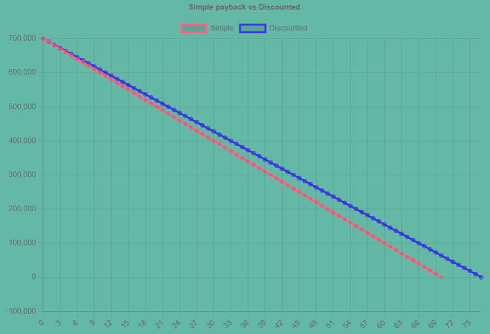

# Guyri: A desktop app to size agricultural engineering projects

Author: Gustavo Santiago 1*

1 Kansas State University, Department of Agronomy

Contact: gustavosantiago@usp.alumni.br

ABSTRACT: The process of sizing has been employed by engineers since the beginning of engineering history. Until a few years ago, the processes were done using only paper, pencil and knowledge. However, the sizing methods followed the computational developed from the recent years and, nowadays, engineers and technicians are able to use simulation and sizing software to support them. A sizing software is basically done by inserting all the calculus, formulas and framework in a script made using one or more computational languages. The objective of this work was to build Guyri, a software to aid agricultural and biosystems engineers and technicians in their sizing projects. Guyri must be done in a desktop application (DA) to work without internet connection and have a user-friendly interface and have the option to download a report in a portable format (PDF). The software portfolio must also encompass many rural engineering project areas. A literature review of the sizing methods were performed to better gather the formulas and insert them in the an algorithm within a computing flow. HTML, CSS and JavaScript were used to build the algorithm, among with frameworks such as Bootstrap for styling and Electron to deploy the app in the form of a DA. A case study were built to demonstrate the functionality and usefulness of the app. On it, a center pivot, a photovoltaic system, a bio digester, a forced ventilation and an economic analysis were sized using Guyri, returning PDF reports containing the inputs and desired outputs. Guyri proved to be able to precisely size many agricultural engineering projects, work without internet connection and generate PDF reports.

Keywords: Size, Agricultural engineering projects, Desktop app

---

## 1. INTRODUCTION

During the process of designing a project, an engineer or technician must be careful to not waste money and resources during the construction as well as after the project is done. To avoid the unnecessary waste, the most correct approach is to size correctly any project. The process of sizing has been employed by engineers since the beginning of engineering history. Until a few years ago, the processes were done using only paper, pencil and knowledge. However, the sizing methods followed the computational developed from the recent years and, nowadays, engineers and technicians are able to use simulation and sizing software to support them. These software are found in many areas, such as energy, aero spatial, construction and many others. Since agricultural engineering projects also request support to accomplish more precision, sizing software are of a great importance in that science area as well.

In the literature and in the market many sizing software agricultural engineering-oriented can be found. Khatib, Mohamed and Sopian (2012) developed a MATLAB user friendly software to size photovoltaic systems, while some described a creation of a wind power sizing. Moving to the irrigation section, many developed a software to size central pivots and others created another software to support sprinkling sizing processes. Following the same approach, there are software to size inputs for a poultry installation and for a nebulization system. As the examples before provided, many efforts are being made in the direction to aid agricultural and biosystems engineers and technicians to accomplish their sizing tasks. However, those software tend to be specific to unique functions, generating a marketing gap for users who need more tools in one place.

The knowledge to perform sizing in many rural engineering projects is taught during the career of any agricultural and biosystems engineer. Because of that, they are able to size those rural engineering projects, such as: irrigation, protected environments, renewable energy and biological related (composting and bio digestion). If they were using a unique software to size at least some of those projects, they would have to install and learn how to use all of them. Despite they also have the knowledge to build a software, it would be time consuming, not being worth for them. That is the reason why a software that aggregates many different agricultural engineering sizing would fill the marketing gap.

A sizing software is basically done by inserting all the calculus, formulas and framework in a script made using one or more computational languages. After that, comes an important step: insert an user-friendly interface to provide to users an easy tool to be used. By having a good interface, the chance for users to make a mistake is reduced. Also, due to most of rural areas in the world do not have access to internet, the software should work without connection. Computational applications that work without internet connection are mobile and desktop applications (if downloaded in a notebook). If used from a desktop, the computational capacity of the software improves by using the computer hardware.  

Following this rationale, the objective of this work was to build Guyri, a software to aid agricultural and biosystems engineers and technicians in their sizing projects. Guyri must be done in a desktop application to work without internet connection and have a user-friendly interface and have the option to download a report in a portable format (PDF). The software portfolio must also encompass many rural engineering project areas.

## 2. MATERIALS E METHODS

### 2.1 Sizing methods sources

The economic analysis is calculated using the formulas of (1) simple payback, (2) discounted payback, return on investment (3) and annual profitability (4). All formulas were obtained from notes made during Economics class of professor Nunes (2018).

 >Simple Payback = Initial Investment / Amount Saved per Month (1)

 >Discounted Payback = Amount Saved per Month / (1 + Minimum attractive rate) (2)

 >Return on Investment = (Gain Obtained - Initial Investment) / Initial Investment (3)

 >Annual Profitability = ( Annual Net Income / Total Invested Amount) * 100 (4)

The dripping sizing was based on the example project in the book "SISTEMAS DE IRRIGAÇÃO LOCALIZADA" by Biscaro et al. (2014), chapter 11, among all mathematical formulas used on Guyri. On, the site is rectangular and aspects of the crop, soil, topography, water and climate were taken. Based on those characteristics, management's variables are calculated. The sectors were pre-defined in the example, but at Guyri, users choose the number of sectors and the algorithm divides the site. Dividing the site takes the measures, length and flow of lateral lines.

The drippers were chosen based on a commercial model. Using Guyri, users can insert drip hose diameters from commercial models or select an algorithm to determine the best diameter. Derivation and Main lines diameters, pressure lost and flow are calculated according to the book's example. On Guyri, all diameters are re-selected based on the closest commercial diameter and pressure lost is re-calculated.

The motor pump and filtering system were calculated according to the book and the outputs are flow, total manometer height, power (for the motor pump) and minimum filtering surface area and minimum filter diameter (for the filtering system). With that information, the engineers can buy the correct motor pump and filtering system (if needed).

The difference between Guyri and the literature is that on the algorithm, sectors are fixed. The consequence of that is sketch format and height cannot be changed, limiting the usage for small and simple projects.

Sprinkling size was based on the section Aspersao Convencional, written by Geraldo Magela Pereira in the book Irrigacao (2001). On it, differently of dripping size, he displays only the formulas and the step-by-step to obtain the inputs and calculate the outputs of the whole process. Guyri gives users management, secondary line, main line, and motor pump information. Users can select if the sprinkler's positions will be changed and the software will calculate different motor pump flow according to the information to save money by buying a stronger motor pump.

Just like on dripping, the sketch format can't be changed and different heights in the site can't be inputted. But, differently from the dripping size, this part of the software can be used in bigger projects. And, in the same way, the diameters are the commercial ones closest to the calculated, and the pressure loss is re-calculated using the commercial diameters of pipes.

The reference used for micro-sprinkling was taken from class annotations and slides presented by the author while attending Irrigation's class at the university. The course was ministered by Profa. Dra. Tamara Maria Gomes at Universidade de Sao Paulo - FZEA. On the occasion, she gave a practical example of how to size a micro-sprinkling, providing all formulas and steps. It is not available due to copyrights.

On the micro-sprinkling section in Guyri, the sketch used is shown below, where the main line is on the horizontal top, the derivation lines are vertical and the secondary lines are horizontal. Besides, micro-sprinkling on the software was made mainly to be used on tree crops.

Just like in the examples above, the diameters are the commercial ones closest to the calculated, and the pressure loss is re-calculated using the commercial diameters of pipes.

For the central pivot, references from de Silva & Azevedo (1998), Almeida (2019) and Junior (2022) were taken. There is a possibility to add a sprinkling canon at the end of the central pivot. On Guyri, every pivot is divided into four sections, with everyone having the same flow. Again, the diameters are the commercial ones closest to the calculated's, and the pressure loss is re-calculated using the commercial diameters of pipes.
Moving to solar heating, a simplified method using as source Wang et al. (2015) was used. The water heating method presented in this software is unglazed/flat plate system.

For the photovoltaic energy sizing, both panels and batteries sizing methods were taken and adapted from Freitas (2008) where, in section 3, she presented an example of sizing, giving all formulas. Using Guyri, users can select if they want to size isolated or connected to power line photovoltaic systems.

Users insert information about annual sun hours, panel power, electric tension of batteries, consumption and efficiency on the platform and it calculates the number of panels, inverter power and battery capacity. Hours of the sun are inserted by users, meaning that it can be chosen from the lowest, highest or average number of hours during the year.

Wind energy sizing was based on Sales, Belem and Alexandre's paper (2018), where they present sizing methods for popular houses. Just like photovoltaic systems, the wind has the option to add batteries, allowing it to be off-grid. References for battery system sizing were taken from Freitas (2008). Calculations to generate power were based on wind power itself, not using a generator. Engineers using the program must pay attention to that detail.

The references for this section were taken from Bergamo (2018). In her work, she compiled formulas and methods of sizing to the following turbines: Pelton, Francis, Kaplan and Michell-Blanki.

On Guyri, first, users fill out a form with basic information about the site and the turbine. Using that information, the algorithm selects the turbine types that would fit on the form filled, and then, users choose the one they prefer.

The biodigester that can be sized using Guyri is of tubular style, just like the picture below. All formulas and instructions were used from Goncalves et al. (2018), with the difference that, on Guyri algorithm, it is possible to select swine and cattle, instead of just cattle like in the literature reference.

The formulas and methodology to be used in the composter section were based on Embrapa's sheet, under the responsibility of Leal (2018). On the sheet, are available instructions, formulas and calculation methods to obtain the ideal ratio of C:N for the composting process.

Forced ventilation section formulas' and process' were obtained and based on Abreu & Abreu (2000) book. On it, they demonstrate how to size ventilation systems for poultry farming. The objective is to use air pushed from fans to remove the heat from inside a building.

The air conditioning system presented here is for domestic and one room purpose. Formulas and calculations were taken from a calculus memorial descriptive, without authoring but from Universidade de Rio Verde – Goias State (2019).

Fogging refrigeration system sizing was obtained from annotations of Prof. Dr. Iran Jose Oliveira da Silva class in 2013. He is a professor at the University of Sao Paulo - ESALQ. On the occasion, he gave an example of sizing to calculate the number of fogging nozzles for poultry farming. To use some variables in the formulas, it was necessary to have values obtained from curves. Using as reference Dantas (2012), curve equations were generated and, in that way, values could be obtained.

The formulas, calculus and frameworks used to build the Guyri were extracted from books, papers and notes/projects made in class. The literature sources can be found on table 1.

Table 1 – Area, project related and literature source used to obtain the sizing methods to insert on Guyri

| Area | Project |	Literature source |
| ---- | ------- | ----------------- |
| Economic Analysis | Economic Analysis | Nunes (2018)
| Irrigation |	Dripping | Biscaro et. al.(2014)
| | Sprinkling |	Pereira (2001)
| |	Central pivot |	Silva & Azevedo (1998), Almeida (2019) and Junior (2022)
| |Micro-sprinkling |	Gomes (2020)
| Energy |	Solar heating |	Wang et al.(2015)
| | Photovoltaic |	Freitas (2008)
| | Wind |	Sales, Belem & Alexandre (2018)
| | Hydroelectric |	Bergamo (2018)
| Biologic |	Composting |	Leal et al.(2018)
| | Biodigester |	Goncalves et al.(2018)
| Protected |	Forced Ventilation |	Abreu & Abreu (2000)
| | Air Conditioner |	Universidade de Rio Verde (2019)
| |Fogging |	Dantas (2012) and da Silva (2013)

### 2.2 Programming languages

Guyri was developed using JavaScript, CSS and HTML. JavaScript was used to i) do the sizing functions, ii) create and open tabs, iii) reports rendering on PDF and iv) electron configurations. The sizing procedures described in the table 1 were inserted in the JavaScript algorithm following the steps described on them. Styling was made using CSS, including the appearance of the lateral and main menus. Lastly, the framework of Guyri was made using HTML.

### 2.3 Frameworks

Bootstrap (Twitter, 2023), a CSS and JavaScript-based framework from Twitter, was responsible for the modals that appear when the user clicks on the "Size!" button. The Electron framework (Electron, 2023) was responsible to generate the DA from a HTML-CSS-JavaScript project. It was set before starting the project. To set it was necessary to create an npm project into a folder using the command on a terminal:

<code>npm init</code>

And, after the project was created, was entered the following command on the terminal:

<code>npm i electron (name of your project)</code>

This command created a folder containing the node modules. After this process, it was necessary to enter in scripts in package.json and write:

<code>"start": "electron ."</code>

After that, was necessary to work on the main JavaScript file to configure the app. To make it start working and test it was necessary to go on the terminal and type:

<code>npm start</code>

To create the app after finalized, was needed to follow the instructions on this Electron’s website, that will be described next. It was typed in the command line the commands:

<code>npm install electron-packager --save-dev</code>

<code>npm install --save-dev electron</code>

Thereon, entered in the package.json file and added, inside scripts, the following line (for Windows): 

<code>"package-win": "electron-packager . Guyri --overwrite --asar=true --platform=win32 --arch=x64 --icon=Icons/Logotipo-2.ico --prune=true --out=release-builds --version-string.CompanyName=CE --version-string.FileDescription=CE --version-string.ProductName=\"Guyri\""</code>

Where: "--arch=x64" means the architecture of the system.

In the functions.js file, a function had to be added to make Electron works. In the function also there is the possibility to change some settings of the DA, such as window size, and the navigation tab at the top. Lastly, to deploy the app, the command was written on the terminal:

<code>npm run package-win</code>

### 2.4 Libraries

Two libraries were used on Guyri: html2pdf (Koopmans, 2023) and chart.js (Chart.js, 2023). The first one is responsible to convert the results modal made using Bootstrap (Twitter, 2023) into a pdf file, allowing users have the inputs and outputs of their sizing on a savable pdf file. The second one generates the chart that compares the "Simple vs Discounted payback" in the Economic Analysis section.

### 2.5 Algorithm organization

In the root folder, there are the main algorithm for the JavaScript, CSS and HTML functions. In the folder called Sizing Pages is each sizing html algorithm. The icons used were downloaded from the internet and are in the folder Icons.

## 4. CASE STUDY AND DISCUSSION

Mrs. Maria Carolina has just graduated from Biosystems Engineering and, to start her life in the agricultural field, she bought a farm. Her farm is located in Goias state, Brazil, having predominantly clay soil. On her farm, she desires to raise dairy cattle and plant soy and corn irrigated using a central pivot. She wants to install a forced ventilation system to refrigerate her cattle. She also desires to construct a bio digester to produce gas and fertilizer from cattle manure. To reduce the energy costs in her farm, she opted to install a photovoltaic system. Lastly, she wants to check the economic analysis for a new tractor, instead of the one already present in the farm (gift from the last owner).

Since the place is new it doesn't have internet connections and since is far away from cellphone companies towers, doesn't have telephone signal. She can't access the internet to help her, therefore, she was a smart student who used to pay attention in all her classes. Because of that, she knows how to size some things she will need, but not all. Because of that, she will might need some help, choosing to use Guyri to achieve precise sizing.

The table 2 shows the particularities of the farm.

Table 2 – Details and information to be inserted in the Guyri.

| Project       | Characteristics | Value |
|---------------|-----------------|-------|
| Central pivot | Eto             | 5.3   |
|               | Kc              | 1.1   |
||Pivot Radius	| 500m
||Pivot in|	Level
||Suction tube in|	Uphill slope: 4m
||Length from suction tube to center pivot|	650m
||Sprinkler service pressure |14 mca
||Sprinkler radius	|14 m
||Distance between sprinklers|	12m
||It does not have a cannon in the end|	-
||Time of a complete turn|	22h
||Pivot tube Hazen-Williams coefficient	|130	||Suction tube Hazen-Williams coefficient|	120
||Flow velocity in the suction line|	2.5 m/s
||Pump performance|	75%
|Photovoltaic|Average monthly consumption|	1040 kWh*
||Hours of full sun in the most critical month|	5 h/day
||Panel power|	250W
||Module Efficiency	|12.50%
|| System On-Grid|	-
|Bio digester|	Cattle|	-
||Number of animals|	150
|Forced Ventilation|	Site Length	|120 m
||Site width|	20 m
||Height of the place with lining|	3.5 m
||Fan capacity|	1200 m3/min
||Air speed|	3.12 m/s
|Economic Analysis|	Total invested Amount|	R$ 700,000
||Amount saved per month **	|R$ 10,000
||Minimum attractive rate|	10%
||Gain Obtained ***	|R$ 1,400,000
||Annual Net Income	|R$ 30,000,000

*The pivot is only used for 3 months, so the amount showed is divided by the whole year.
**Amount estimated considering fuel, mechanics, time and labor.
***Gain obtained for a whole both harvest (soy/corn).

Maria Carolina launched Guyri on her laptop and saw the home page (Figure 1) and selected and inserted the information on the pages (Figure 2). After selecting and entering the information presented on table 2 on the respective pages, she obtained the PDFs of the reports.

Figure 1 -  Home page of Guyri

Figure 2 – Page of Center Pivot

After analyzing the reports made by the app, she knew that in:

*	The central pivot, the required flow (214 m3/h); the application intensity and the flow of each sprinkler in each quarter of the pivot (7.53, 18.19, 23.71, 27.92 mm/h and 2.53, 6.11, 7.96, 10.53 m3/h); the tube diameter in each quarter of the pivot (0.1, 0.09, 0.075 and 0.075 m), the suction line diameter (0.16), the manometer height (62.24 mca) and the motor pump power (72.352 cv);

*	The photovoltaic, the number of panels needed: 32 and the inverter power (7800w);

*	The bio digester, the liters of water that has to be added per day (3750), the bottom base (2.94m), the upper base (4.76m), the height (2.5m), the length (23.82m), the gas production estimate (150 m3/day), the canvas area (12.4m2), the input box width and length (3.03m), the input and output box height (1m) and the outlet box width and length (5.25m);

*	The forced ventilation, the total number of fans (12) and the required air intake area (70m2);

*	The economic analysis, the simple payback months (70), the months for discounted payback (77), the return of investment (100%) and the annual profitability (4285.71%). The graph generated from the economic analysis can be seen in the figure 3.

Figure 3 – Graph generated from the economic analysis in the study case comparing the simple vs discounted payback for a tractor purchase

 
Concluding, Mrs. Maria Carolina now has the majority of needed information to start the desired projects in her farm. If she desires to take the information she had among with the outputs given by Guyri to professionals in each sizing field, she would be able to do so because she has the reports. If she wants to simulate sizing inputting new values, and maybe figure out if another variables would be a better fit, she would be able to do it using Guyri as well.
If she was using another apps if not Guyri, she wouldn’t be able to do the sizing projects due to internet limitations or just because it would have to use too many apps for each project. However, some limitations of the app includes i) lack of details in some sections such as the Economic Analysis, that should be more incremented and complete, ii) irrigation sections only allows sizing in square or rectangular sites, iii) addition of one more straw source in composting, iv) more bio digester project style, since Guyri uses the Canadian style and lastly v) the possibility to save users’ projects in the cloud.

In future works, all those problems should be addressed, including the possibility to save users’ projects in the cloud by creating account and storing the inputs and outputs in a database. To address this problem, there will be the challenge to synchronize the projects done with the cloud whenever the client has internet connection. This way, Guyri can continue working without internet connection but will still has the possibility to store information.

## 5. CONCLUSION

The desktop application built in this work (Guyri) were able to size many different sizing projects encompassing a vast area of knowledge, aiding agricultural and biosystems engineers and technicians in their works. It has an user-friendly interface, can work without internet connection and generates a PDF report.

## REFERENCES

Build cross-platform desktop apps with JavaScript, HTML, and CSS | Electron [WWW Document], n.d. URL https://electronjs.org/ (accessed 6.24.23).
chartjs/Chart.js, 2023.

contributors, M.O., Jacob Thornton, and Bootstrap, n.d. Introduction [WWW Document]. URL https://getbootstrap.com/docs/4.0/getting-started/introduction/ (accessed 6.24.23).

Khatib, T., Mohamed, A., Sopian, K., 2012. A software tool for optimal sizing of PV systems in Malaysia. Model. Simul. Eng. 2012, 10:10. https://doi.org/10.1155/2012/969248

Koopmans, E., 2023. html2pdf.js.

Wang, Z., Yang, W., Qiu, F., Zhang, X., Zhao, X., 2015. Solar water heating: From theory, application, marketing and research. Renewable and Sustainable Energy Reviews 41, 68–84. https://doi.org/10.1016/j.rser.2014.08.026

Biscaro, Guilherme A. et al. SISTEMAS DE IRRIGAÇÃO LOCALIZADA. Ed. UFGD - Dourados, MS (2014). ISBN: 978-85-8147-085-6, 256p.

PEREIRA, G. M. . IRRIGAÇÃO POR ASPERSÃO CONVENCIONAL. Lavras-MG: UFLA, 2001 (APOSTÍLA).

SILVA, E.M. da; AZEVEDO, J.A. de. Dimensionamento da lateral de irrigação do pivô-central. Planaltina: Embrapa-CPAC, 1998. 54p.

Almeida, Isabela Alvarenga. Dimensionamento econômico para sistemas de irrigação pivô central telescópico: estudos de cenários para diferentes regiões do Brasil. Dissertação (Mestrado) - - USP / Escola Superior de Agricultura “Luiz de Queiroz", Piracicaba, 2019. 92 p.

Junior, Joao B. Tolentino. Irrigacao Pressurizada. Online Book. Available at: <a href="https://irrigacao.tolentino.pro.br/">https://irrigacao.tolentino.pro.br/</a>

Freitas, Susana S. A. Dimensionamento de sistemas fotovoltaicos. Relatorio de projecto para obtencao do grau de Mestre em Engenharia Industrial. Instituto Politecnico de Braganca, 2008, 105p.

Sales, Maria E. de O.; Belem, Gabriel da S. & Alexandre, Geronimo B. Dimensionamento um sistema eolico isolado para casas populares. CONTECC, Maceio-AL, Brasil, August 21 to 24 of 2018.

BERGAMO, Paula R. Specifications of hydraulic turbines. 2018. 72f.Course Completion work - Course in Electrical Engineering, Universidade Tecnológica Federal do Paraná. Pato Branco, 2018.

Leal, Marco A. de A. Calculo de Compostagem. Embrapa, available at: <a href="https://view.officeapps.live.com/op/view.aspx?src=https%3A%2F%2Fciorganicos.com.br%2Fwp-content%2Fuploads%2F2017%2F10%2FPlanilha-de-calculo-de-compostagem-Embrapa-Agrobiologia-22.SNA_.OrganicsNet.CI-Organicos-22.xlsx&wdOrigin=BROWSELINK">https://view.officeapps.live.com/op/view.aspx?src=https%3A%2F%2Fciorganicos.com.br%2Fwp-content%2Fuploads%2F2017%2F10%2FPlanilha-de-calculo-de-compostagem-Embrapa-Agrobiologia-22.SNA_.OrganicsNet.CI-Organicos-22.xlsx&wdOrigin=BROWSELINK</a>

ABREU, P.G. de; ABREU, V.M.N. Ventilação na avicultura de
corte. Concórdia: Embrapa Suínos e Aves, 2000. 50p.

Dantas, Luís Antônio. Soluções computacionais analítico-numéricas aplicadas à simulação de secagem de produtos biológicos. Tese (Doutorado em Engenharia de Processos) - Universidade Federal de Campina Grande, Centro de Ciências e Tecnologia, 2012, 124p.
